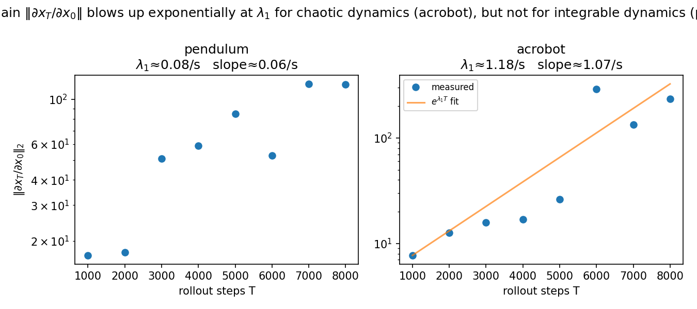

# PredictabilityHorizon — Lyapunov exponents as predictability diagnostics

The largest Lyapunov exponent λ₁ governs predictability in two pillars of Physical AI,
and this repo measures both on differentiable robot-learning systems built in
**NVIDIA Warp** (CPU).



**Part A — differentiable simulators.** The rollout's input–output Jacobian
‖∂x_T/∂x₀‖₂ — the gradient gain reverse-mode autodiff propagates — grows as
e^{λ₁T} (one factor of λ₁). So analytic simulator gradients are usable only for
horizons T ≲ 1/λ₁. Verified to machine precision on a linear map; on the chaotic
acrobot the measured gradient-gain rate is consistent with the independently-measured
λ₁ to within finite-time scatter. A sweep across regimes (pendulum + acrobot energies)
confirms the slope tracks λ₁ with correlation 0.99 (Fig. 5), and the T ≲ 1/λ₁ horizon
is demonstrated directly via the analytic-gradient SNR (Fig. 6).

**Part B — learned world models.** A small MLP world model reproduces an integrable
system's near-zero Lyapunov exponent but **over-amplifies the chaotic one** (its learned
λ₁ is ill-conditioned) — because a next-step-accuracy objective does not constrain the
Jacobian/sensitivity structure (the learned dynamics break volume-preservation). A
cautionary result for certifying the physical fidelity of large world models (e.g. Cosmos).

See `writeup/note.md` for the full method, results, and honest limitations.

---

## Install

```bash
git clone https://github.com/benjquant/PredictabilityHorizon.git
cd PredictabilityHorizon
python -m venv .venv && source .venv/bin/activate
pip install -e ".[dev]"
```

## Quickstart

```python
import numpy as np
from predictability_horizon.gradient_law import gradient_law
from predictability_horizon.systems import SYSTEMS, acrobot  # noqa: F401 (register)

s = SYSTEMS["acrobot"]
H = np.arange(1000, 9000, 1000)
r = gradient_law(s.step_kernel, np.array([2.5, 0, 0, 0.0]),
                 s.default_params, s.suggested_dt, H, 4, s.jacobian)
print("gradient-gain slope /step:", r.slope_per_step)
print("lambda_1 * dt        /step:", r.lambda1_per_step)
```

## CLI

```bash
predictability-horizon systems           # list the registered dynamical systems
predictability-horizon reproduce         # regenerate all six figures (world models + Part-A sweeps; ~15 min)
predictability-horizon reproduce --out path/to/output_dir
```

## Tests

```bash
pytest -m "not integration" -q   # fast subset (seconds); recommended for normal use
pytest -q                        # full suite (20+ min; world-model training tests are @pytest.mark.integration)
```

## Notebook

`notebooks/01_quickstart.ipynb` — runs the acrobot gradient-law inline and produces a local `fig1_demo.png`.

## Figures

| Figure | Description |
|--------|-------------|
| `writeup/figures/fig1.png` | Gradient-gain ‖∂x_T/∂x₀‖₂ vs horizon — slope tracks λ₁ for the chaotic acrobot, flat for the integrable pendulum |
| `writeup/figures/fig2.png` | Cartpole swing-up loss curve via differentiable simulation |
| `writeup/figures/fig3.png` | World-model prediction-error growth, integrable vs chaotic |
| `writeup/figures/fig4.png` | Learned vs true λ₁ — the surrogate over-amplifies the chaotic exponent |
| `writeup/figures/fig5.png` | Gradient-gain slope vs λ₁ across regimes (pendulum + acrobot energy sweep) — points track y=x, corr 0.99 |
| `writeup/figures/fig6.png` | Analytic-gradient SNR vs Lyapunov time T·λ₁ — degrades through the predictability horizon |

## Systems

| System | Dynamics | dim | λ₁ |
|--------|----------|-----|----|
| `pendulum` | integrable (single pendulum) | 2 | ≈ 0 |
| `cartpole` | underactuated | 4 | — |
| `acrobot` | chaotic (double pendulum) | 4 | > 0 |

## Citation

See `CITATION.cff`.

## License

MIT — see `LICENSE`.
