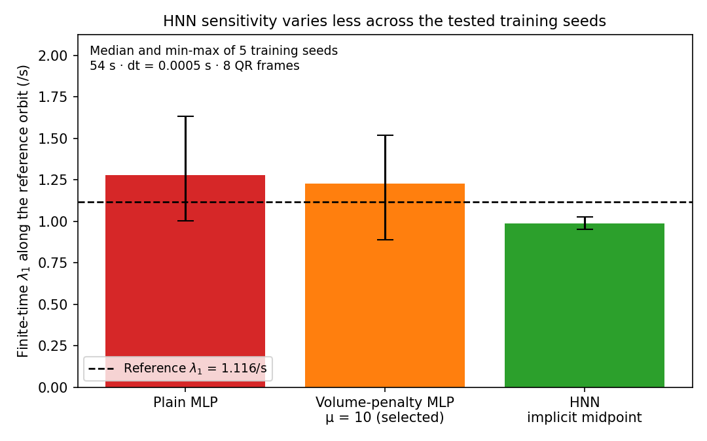

# PredictabilityHorizon — Lyapunov exponents as predictability diagnostics

Sensitivity diagnostics for differentiable simulators and small learned world models,
built with **NVIDIA Warp on CPU**. The corrected acrobot uses canonical momenta and
implicit midpoint integration.

- **Gradient growth:** across 11 pendulum, acrobot, and Hénon–Heiles regimes, the
  gradient-gain slope tracks the finite-time Lyapunov estimate (correlation 0.969,
  regression slope 0.986; Figure 5).
- **Trajectory optimisation:** Figure 2 compares precise reaching and forgiving
  swing-up under a fixed optimiser budget. Acrobot reaching has geometric mean cost above the
  zero-control baseline from four tested Lyapunov times onward; pendulum and swing-up
  geometric means stay below it. This is not a universal optimisation cutoff.
- **Learned sensitivity:** in the saved five-training-seed study, the HNN has a much
  narrower range than the plain or tuned penalty MLP. The selected penalty model
  has a slightly closer median to the reference. Structure does not guarantee exact
  sensitivity recovery (Figure 7).



The [paper](writeup/paper.pdf) is the public result summary, including protocols and
limitations; the Introduction and Abstract remain drafts. Figures 2, 5, and 7 contain
current evidence (these numbers identify the `figN.png` source files).
Figures 1, 3, 4, 6, and 8 are explicitly historical and retain the
retired velocity-state acrobot experiment. They do not validate the corrected simulator.
These toy-system results do not establish Cosmos or real-robot performance.

The `acrobot-symplectic` branch is retained for an application link.
[Main](https://github.com/benjquant/PredictabilityHorizon/tree/main) is the destination
for subsequent development after integration.

## Install

```bash
git clone https://github.com/benjquant/PredictabilityHorizon.git
cd PredictabilityHorizon
python -m venv .venv
source .venv/bin/activate
pip install -e ".[dev]"
```

## Reproduce

Render Figure 7 from the [committed measurements](writeup/figures/partb_ablation.json),
without training or private files, from the installed repository checkout:

```bash
python -c 'from pathlib import Path; from predictability_horizon.viz import make_fig7_structured_spectrum; make_fig7_structured_spectrum(Path("output/fig7.png"))'
```

The output directory can be changed independently of the input. The Python function
also accepts `results=Path("path/to/partb_ablation.json")` for an explicit saved input.
The plot uses medians and min–max ranges across five training seeds, with dataset seed
fixed at 0. Measurements average eight QR initialisations (`k=4`) over 54 seconds at
`dt=0.0005`, along the reference trajectory from canonical state `(2.5, 0, 0, 0)`.
The penalty weight μ = 10 was selected from the tested sweep; ranges are not confidence
intervals, and the measurements do not test autonomous learned-model rollouts.

```bash
predictability-horizon systems
predictability-horizon reproduce --out path/to/output_dir
```

Full reproduction runs all eight generators using the current code, including long
optimisation sweeps and model training for Figures 3 and 4; Figure 7 only reads saved
results. This is not a byte-for-byte recreation of the historical plots in the paper.

## Validation

```bash
make lint
make typecheck
make test
make calibration
```

The suite includes integration tests. For exploration, see
[the quickstart notebook](notebooks/01_quickstart.ipynb).
Registered systems are pendulum, acrobot, Hénon–Heiles, and cartpole; cartpole is not
part of the paper's retained evidence.

## Citation and license

See [CITATION.cff](CITATION.cff) and the [MIT license](LICENSE).
